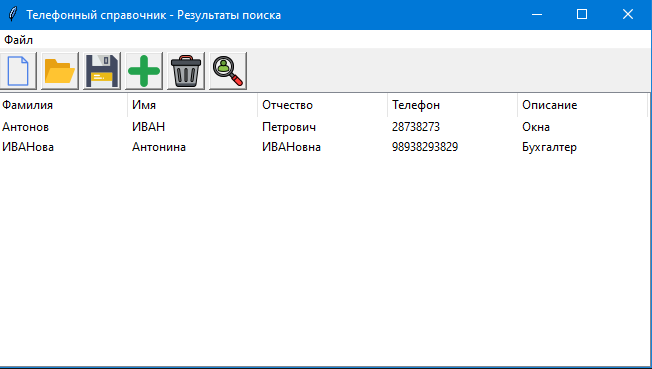

## Программа "Телефонный справочник" (использование tkinter)

* Загрузка данных

* Редактирование данных

* Добавление данных

Проверка на существующий телефонный номер:

* Удаление данных

* Поиск данных

